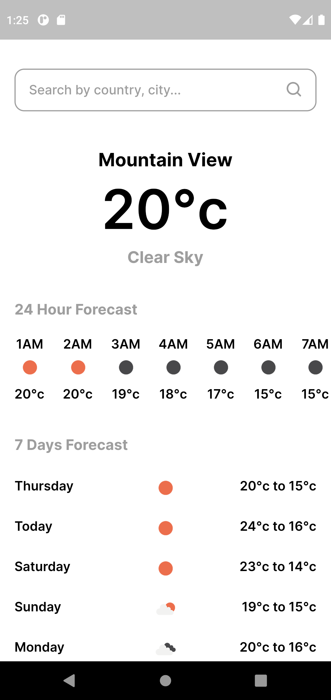
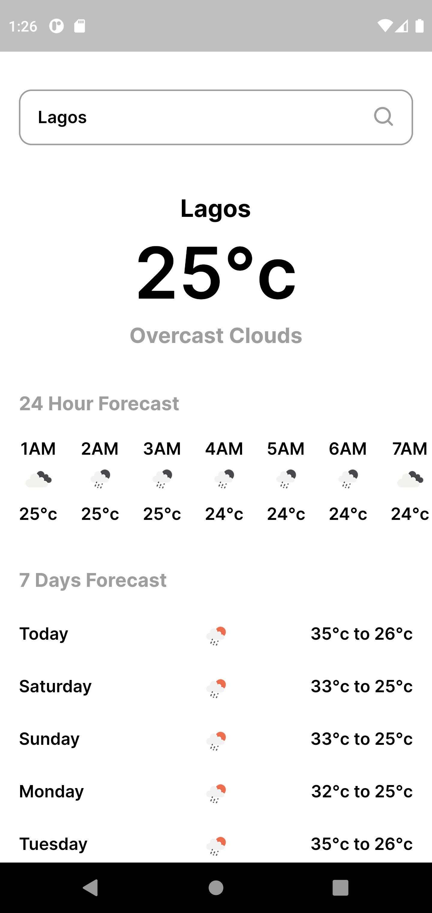
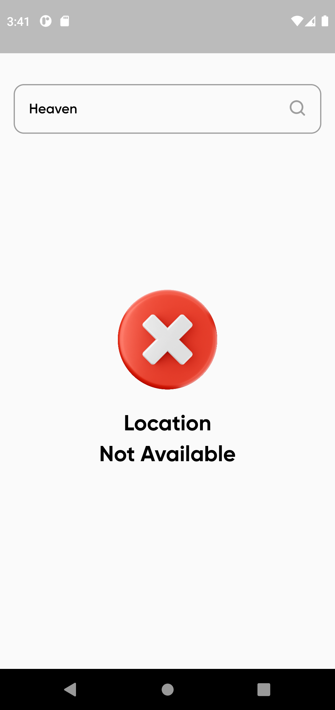

# Open Weather - Weather Forecast Application

Open Weather is a test mobile application to predict weather conditions. It was developed using Dart and Flutter with Flutter BLoC for state management and the API is from [Open Weather Map](https://api.openweathermap.org/). The architecture is a combination of Uncle Bob's Clean Architecture and BLoC which is the recommended pattern for Flutter applications.

## :camera: Screenshots

<div style="display: flex;">
  
  
  
</div>

## :clipboard: Requirements

- Operating System (Windows, Linux or MacOS)
- Flutter must be installed on the Operating System
- Knowledge of the Flutter Framework
- IDE (Visual Studio Code, Android Studio e.t.c)
- Mobile Emulator or Mobile Device
- Hands to code :smile:

## :pushpin: Dependencies

- dartz: ^0.10.1
- equatable: ^2.0.3
- http: ^0.13.5
- get_it: ^7.2.0
- flutter_bloc: ^8.1.1
- flutter_svg: ^1.0.3
  reactive_forms: ^12.0.0

## :rocket: Getting Started

NOTE: You must have Flutter installed to run this project. You can learn about the installation [here](https://www.google.com/url?sa=t&rct=j&q=&esrc=s&source=web&cd=&cad=rja&uact=8&ved=2ahUKEwj2sp_h9e_5AhUSP-wKHQrvCx4QFnoECAkQAQ&url=https%3A%2F%2Fdocs.flutter.dev%2Fget-started%2Finstall&usg=AOvVaw0_DysGRxe6bHMb0c8Whvun).

#### 1. Clone the repository

```sh
$ git clone https://github.com/devwraithe/mobile_showcases
```

#### 2. Move to the project directory

```
$ cd mobile_showcase
```

#### 3. Install the required dependencies

```sh
$ flutter pub get
```

#### 4. Run the application (on a mobile device)

```sh
$ flutter run
```

## :heart: Think it's great?

If you love this project and you find it useful, please consider giving it a :star: and share it with everyone you know :heart_eyes:.

## :question: Need Help?

- For support, you can get in touch with me via [LinkedIn](https://www.linkedin.com/in/ibrahimaibrahim)
